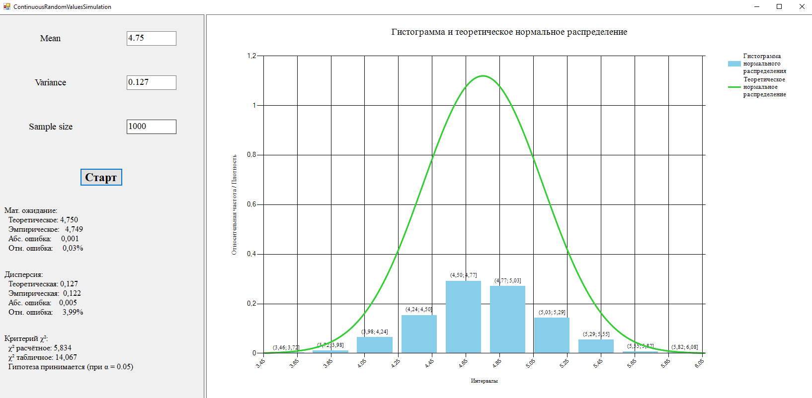

# 📊 ContinuousRandomValuesSimulation

Simulation of continuous random values with **normal distribution** (Box–Muller transform).  
Симуляция непрерывных случайных величин с **нормальным распределением** (преобразование Бокса–Мюллера).

---

## 📌 About / О проекте

🎓 Developed as part of a simulation modeling course.  
📊 Demonstrates generation of normal-distributed samples, histogram plotting, and hypothesis testing.  
📦 Built with C# WinForms, using Math.NET Numerics for statistical tests.

🎓 Разработано в рамках курса по имитационному моделированию.  
📊 Демонстрирует генерацию выборок с нормальным распределением, построение гистограммы и проверку гипотез.  
📦 Реализовано на C# WinForms с использованием Math.NET Numerics для статистических тестов.

---

## 🔧 Features / Возможности

- 🔢 **Input parameters**: mean, variance, sample size  
  Ввод параметров: мат. ожидание, дисперсия, объём выборки

- 🎲 **Sample generation** using Box–Muller transform  
  Генерация выборки с помощью преобразования Бокса–Мюллера

- 📊 **Histogram of empirical distribution**  
  Построение гистограммы эмпирического распределения

- 📈 **Overlay of theoretical normal PDF**  
  Наложение теоретической функции плотности нормального распределения

- 🧮 **Probability characteristics**:  
  - Empirical vs theoretical mean and variance  
  - Absolute & relative errors  
  - Chi-squared goodness-of-fit test  

  **Вероятностные характеристики**:  
  - Теоретическое и эмпирическое мат. ожидание и дисперсия  
  - Абсолютные и относительные ошибки  
  - Критерий согласия χ² (хи-квадрат)

---

## 📁 Structure / Структура

- `Form_Main.cs` — UI + logic for validation, sample generation, statistics  
  Основная форма: ввод параметров, генерация выборки, расчёт статистик

- `GenerateNormalDistribution()` — Box–Muller method implementation  
  Реализация метода Бокса–Мюллера для генерации выборки

- `DrawStatistics()` — builds histogram and overlays theoretical PDF  
  Построение гистограммы и теоретической плотности распределения

- `CalculateAndShowProbCharacteristics()` — errors and χ²-test  
  Расчёт ошибок и проверка гипотезы по критерию χ²

---

## 🖼 Screenshots / Скриншоты

  
*Рис. 1 — Главное окно программы (пример)*

---
